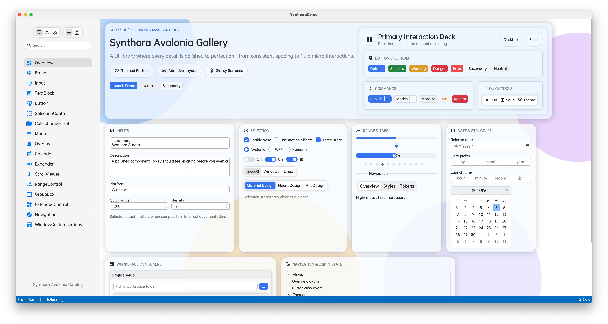
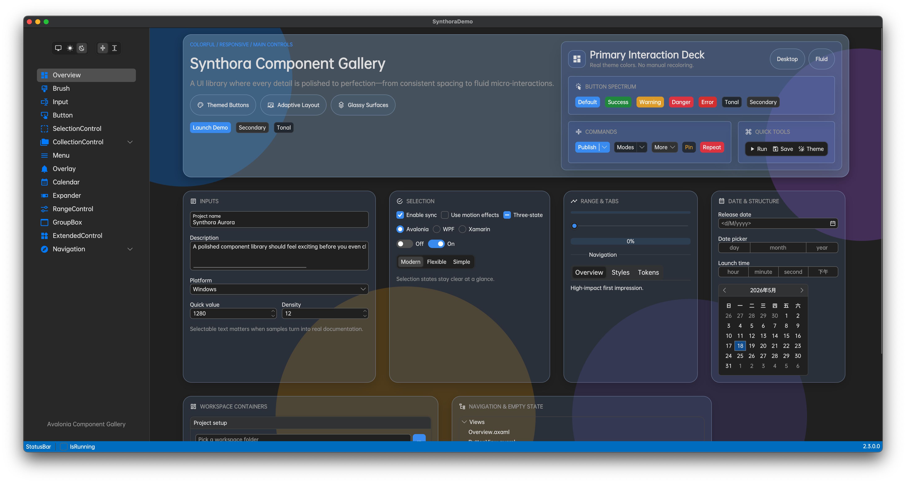

 [](https://www.nuget.org/packages/Synthora)

# Synthora
Modern control styles and themes for [Avalonia](https://github.com/AvaloniaUI/Avalonia) apps.

# 💡 Install
Add nuget package:
```bash
dotnet add package Synthora
```

# 🚀 Quick Start
Update your `App.axaml`:
``` xml
<Application.Styles> 
    <SynthoraTheme /> 
</Application.Styles>
```

# 📷 Screenshots



# 📦 Build & Package Demo

The following instructions are for packaging the **SynthoraDemo** application.

## Windows

1. Install [Inno Setup](https://jrsoftware.org/isinfo.php)
2. Run the build script:

```bash
.\Demo\Synthora.Demo.Desktop\win-build\build.bat
```

## macOS

1. Install [DMG Canvas](https://www.araelium.com/dmgcanvas)
2. Run the build script:

```bash
chmod +x Demo/Synthora.Demo.Desktop/mac-build/build.command
./Demo/Synthora.Demo.Desktop/mac-build/build.command
```

> **If the app cannot be opened after installation**, run the following command to remove the quarantine attribute:
> ```bash
> xattr -cr /Applications/SynthoraDemo.app
> ```