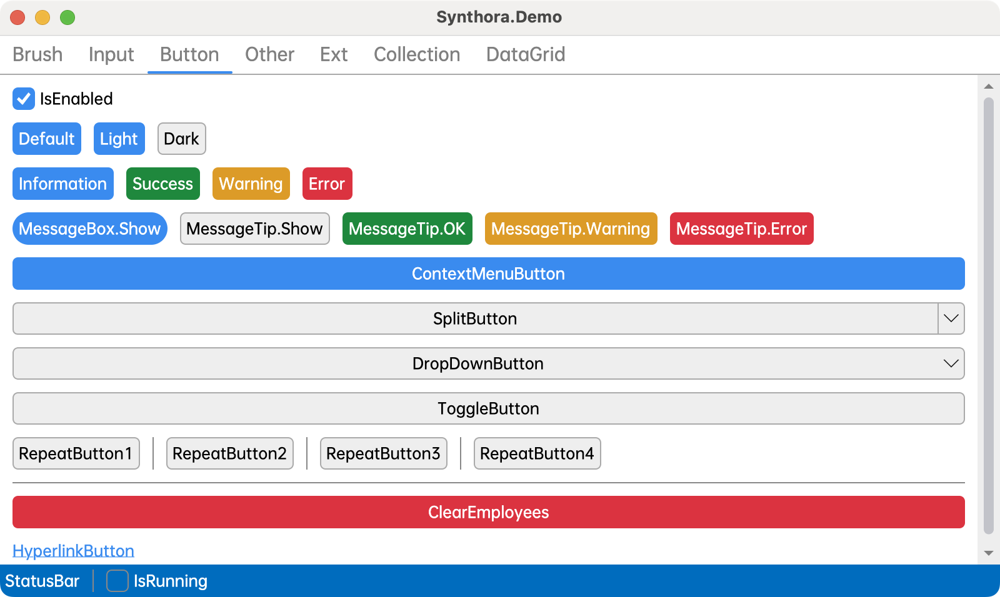

# Synthora
Avalonia control styles and themes

# 💡 Install
Add nuget package:
```bash
dotnet add package Synthora
```

# 🚀 Quick Start
``` xml
<Application.Styles> 
    <SynthoraTheme /> 
</Application.Styles>
```

# 📷 ScreenShot
